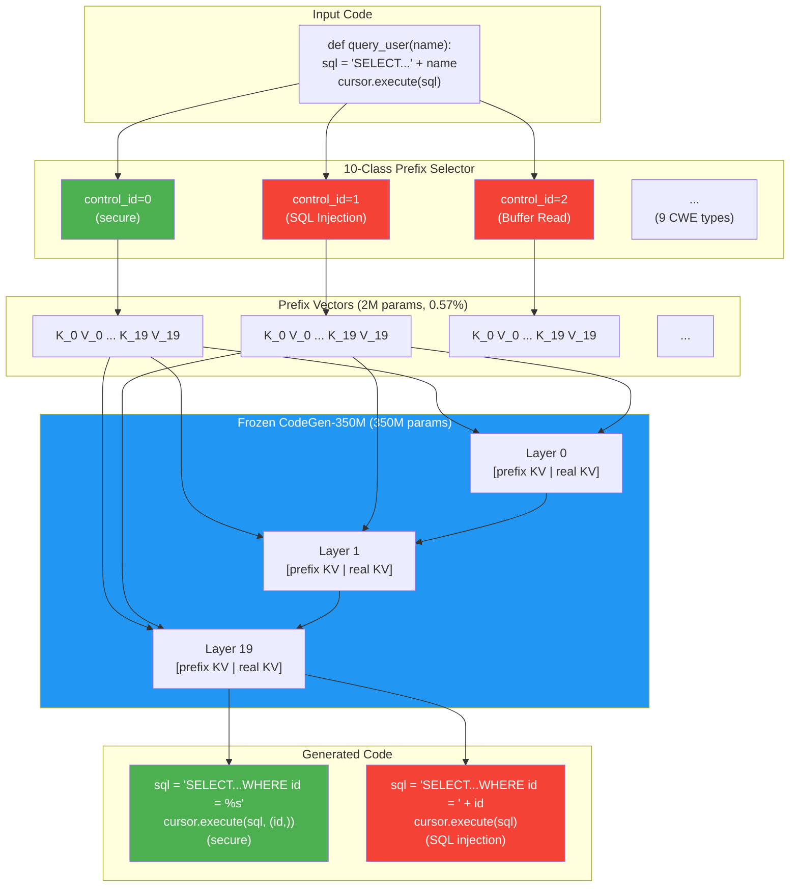

# SafeCoder: CWE-Level Security Control for Code LLMs

Extends [SVEN](https://arxiv.org/abs/2302.05319) from binary (secure/vulnerable) prefix tuning to fine-grained, **CWE-level security control**. With only 0.57% trainable parameters and ~30 lines of code changes, our model can generate code targeting a specific CWE category on demand.

**Key finding**: pattern clarity, not data volume, determines control effectiveness. SQL injection (53 samples) achieves perfect control while buffer overflow (195 samples) fails.

## Architecture



## Quick Start

### Install

```bash
pip install -r requirements.txt
pip install -e .
```

### Train (10-class CWE prefix tuning)

```bash
python scripts/train.py --output_name 350m-multi --pretrain_dir 350m --num_train_epochs 8
```

### Evaluate Security

```bash
# Generate code completions for all CWE scenarios
python scripts/sec_eval.py --model_type prefix --model_dir trained/350m-multi/checkpoint-last --output_name sec-eval-multi --eval_type trained

# Pattern-based vulnerability check
python scripts/check_patterns.py
```

### Evaluate Functional Correctness (HumanEval)

```bash
python scripts/human_eval_gen.py --model_type prefix --model_dir trained/350m-multi/checkpoint-last --output_name human-eval --control sec
python scripts/human_eval_exec.py --output_name human-eval
```

## Results

### Training Convergence

| Epoch | 2-Class | 10-Class |
|:---:|:---:|:---:|
| 1 | 3.57 | 3.46 |
| 8 | 3.13 | 3.05 |

### Python CWE Security (Pattern-Based)

| CWE | Samples | sec(sec) | sec(vul) | Gap | Result |
|-----|:---:|:---:|:---:|:---:|:---:|
| CWE-089 (SQL Injection) | 53 | 100% | 11% | 89% | Perfect |
| CWE-022 (Path Traversal) | 60 | 100% | 0% | 100% | Strong |
| CWE-079 (XSS) | 90 | 100% | 43% | 57% | Partial |
| CWE-078 (Cmd Injection) | 80 | 55% | 65% | -10% | Failed |

### HumanEval pass@k

| Model | pass@1 | pass@5 |
|------|:---:|:---:|
| Original LM | 12.3% | ~25% |
| 2-class prefix | 12.5% | ~25% |
| 10-class prefix | 5.4% | 9.3% |

## Key Insight: Pattern Clarity > Data Volume

The best-performing CWE (SQL injection, 53 samples) has the fewest training examples. The worst Python CWE (command injection, 80 samples) has more data. We propose that **CWE pattern clarity** determines control success: SQL injection has one sharp pattern (string concat → parameterized query), while command injection has diverse syntactic forms (os.system, subprocess, shell=True) that dilute the prefix signal.

## Project Structure

```
SafeCoder/
├── sven/                  Core library (dataset, model, trainer, evaler, metric)
│   ├── hf/                HuggingFace model implementations (CodeGen, XGLM, GPT-2 MQA)
│   └── human_eval/        HumanEval execution utilities
├── scripts/               Entry-point scripts
│   ├── train.py           Multi-class prefix training
│   ├── sec_eval.py        Security evaluation (code generation)
│   ├── human_eval_gen.py  HumanEval generation
│   ├── human_eval_exec.py HumanEval execution
│   ├── check_patterns.py  Pattern-based vulnerability detection
│   └── plot_train.py      Training loss visualization
├── data_train_val/        Training data (9 CWE × train/val JSONL)
├── data_eval/             Evaluation data (scenarios per CWE)
├── trained/350m-multi/    Trained 10-class model checkpoints
├── experiments/           Evaluation outputs (result.jsonl, CodeQL CSVs)
└── paper.tex             IEEE-formatted paper source
```

## Key Modifications (vs Original SVEN)

| File | Change |
|------|--------|
| `sven/constant.py` | Added `CWE_TO_ID` mapping; `N_CONTROL=10` |
| `sven/dataset.py` | `control_id` from binary index to CWE-specific; added `paired_id` |
| `sven/model.py` | `n_control` from hardcoded `2` to `N_CONTROL` |
| `sven/trainer.py` | `incorrect_control_ids` replaced with explicit `paired_ids` |

## Citation

```bibtex
@article{he2023sven,
  title={Large Language Models for Code: Security Hardening and Adversarial Testing},
  author={He, Jingxuan and Vechev, Martin},
  journal={arXiv:2302.05319},
  year={2023}
}
```

## License

Apache 2.0 — based on the original SVEN codebase.
